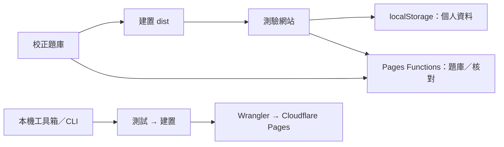

# 系統架構

## 技術與模組

| 模組 | 檔案 | 職責 |
| --- | --- | --- |
| 網站介面 | `public/index.html`、`app.js`、`style.css` | 路由、DOM、測驗／結算、分頁、視窗與提示 |
| 個人資料與規則 | `public/core.js` | LocalRepository、驗證／遷移、答案正規化、抽題及一次性儲存 |
| 校正題庫 | `data/catalog.js` | 原始來源＋校正版，保留 ID、合併字形與分級 |
| HTTP API | `lib/api.js` | 無狀態題庫查詢、指定 ID 與答案核對 |
| Cloudflare 接口 | `functions/api/[[path]].js` | 將 Pages Functions 請求交給 API handler |
| 網站建置 | `tools/build.mjs` | 嵌入題庫，複製靜態資源至 `dist` |
| 本機網站 | `tools/serve.mjs` | 靜態檔＋同一 API handler，預設 port 8015 |
| 維護流程 | `tools/workflows.mjs` | 驗證、發布、分支檢查及提交／推送 |
| 本機工具箱 | `tools/toolbox.mjs`、`tools/toolbox/` | 維護頁面、單工作執行與進度紀錄，port 8025 |

網站採原生 JavaScript、HTML／CSS，不使用前端框架或打包器。題庫在建置時嵌入 HTML，前端及 Functions 使用相同的校正資料與核對規則。

## 測驗生命週期

設定畫面選分類及題數；LocalRepository 依字形去重及統計權重抽題，保存本輪快照。Enter 作答時處理輸入法與重複按鍵；內建字呼叫無狀態 API，自訂字在瀏覽器核對。API 斷線或逾時時，使用已載入的校正題庫核對。

LocalRepository 將結果、正確／錯誤計數及下一題進度合併為一次 localStorage 寫入。寫入成功才更新記憶體及介面，避免重試重複計分。切換頁面、提前結束或返回開始畫面會取消待回覆答案，晚到的回應不能新增紀錄。

作答完成或提前結束進入結算，正確率只用實際已答題目。錯題篩選只影響清單與分頁，不修改統計、結果或重練候選。新輪次／重新整理預設顯示全部。網站名稱返回全部／10 題設定，清除輪次，保留個人單字、書籤及累計統計。

## 本機與雲端邊界

- 網站沒有登入、Cookie session、後端個人資料庫或自動同步。
- Functions 看不到使用者的 localStorage。書籤與自訂字 CRUD 是本機操作，不是 HTTP REST API。
- `public/_routes.json` 僅讓 `/api/*` 呼叫 Functions，其餘為靜態檔。
- `/quiz`、`/bookmarks`、`/words` 支援 SPA 路由；舊 `/history` 在前端導向測驗。
- 工具箱僅綁定 `127.0.0.1`，不放進 `dist`、不部署至公開網站。它使用現有 Git／Wrangler 認證；不建立或保存 API 金鑰。
- 工具箱一次執行一個工作；重新整理可接續查看執行紀錄。紀錄只存在本次工具箱行程，重新啟動不保留。

## 建置與發布

`tools/build.mjs` 只重建 repo 內的 `dist`，安全轉義嵌入 JSON，輸出網頁、JS／CSS、路由／標頭、來源說明與校正版擴充資料下載。根目錄 `functions/` 在 Wrangler 發布時另行編譯；不能只把靜態 ZIP 拖進 dashboard 就期待 Functions 自動建置。

工具箱、CLI 與 CI 共用同一套測試／建置流程。GitHub 推送及 PR 只觸發驗證；發布是獨立操作。詳細指令見 [發布文檔](deployment.md)。
